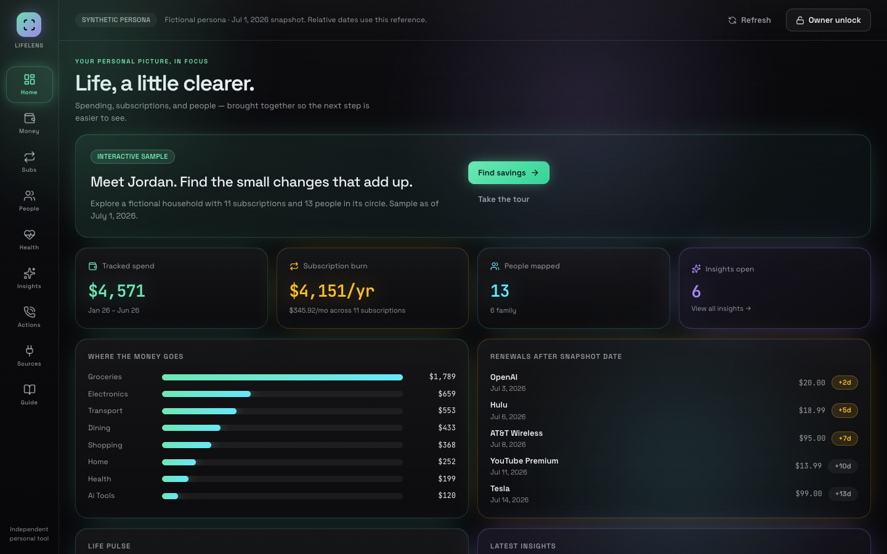

# LifeLens

**A personal life and money workspace with explainable results.** Built by Shanto Mathew.

[Open the public demo](https://lifelens-copilot.netlify.app) · [Architecture & data model](docs/architecture.md) · [Demo walkthrough](docs/demo-script.md) · [Verification](docs/VERIFICATION-2026-09-14.md)

**React 19 · TypeScript · Netlify Functions · deterministic analytics · Supabase adapter**



*Actual production screenshot. Jordan Rivera is a fictional persona with a fixed July 1, 2026 reference date.*

LifeLens turns a typed personal snapshot into spending rollups, subscription renewal projections, relationship signals and useful next steps. The public experience is reproducible: calculations, comparisons, briefs and scripts use deterministic rules and sample catalog data. The code also implements a separate owner-gated Supabase read/write path and optional provider integrations.

## Try it in 90 seconds

1. Open **Home → Money** to inspect the sample totals and transaction evidence.
2. Open **Subs**, expand AT&T, then **Compare sample alternatives** to complete a labeled catalog comparison.
3. Open **Insights → Generate snapshot brief**. The completed result identifies its rule-based source.
4. Open **Actions**, use a synthetic target/goal, generate a script, then **Simulate call**. The result is a dry run; no call is placed.
5. Explore **People**, **Health**, **Sources** and **Guide**. Owner integrations are explicitly gated.


*Completed public API workflow, not a design mockup. Values describe the sample dataset, not a bank balance or current vendor quote.*

## Engineering to review

| Capability | Implementation |
|---|---|
| Typed domain | [`src/lib/types.ts`](src/lib/types.ts): profile, transactions, subscriptions, people, alternatives, insights, events, accounts and actions |
| Explainable analysis | [`src/engine`](src/engine): normalization, recurrence, spend rollups and relationship calculations |
| Public/private boundary | [`_shared/runtime.mjs`](netlify/functions/_shared/runtime.mjs): owner-secret comparison, bounded input parsing and deterministic response helpers |
| Streaming results | [`netlify/functions`](netlify/functions): validated SSE routes; public requests use sample/rule-based paths |
| Owner database reads | [`snapshot.mjs`](netlify/functions/snapshot.mjs): server-side Supabase PostgREST reads and typed mapping |
| Owner writes and maintenance | [`action.mjs`](netlify/functions/action.mjs) records actions; [`ingest-run.mjs`](netlify/functions/ingest-run.mjs) reads stored records, updates renewals and inserts insights/run records behind a manual authorization gate |

The [architecture and data model](docs/architecture.md) distinguish the implemented Supabase adapter from database infrastructure evidence. **No SQL migrations, DDL or SQLite implementation are included in this repository.** Deployed schema, RLS policies, private reads/writes and owner-provider execution were not verified in the public release. The adapter sends a server-side anon key plus a custom gate header; it does not use a service-role key. No RDS or database HA claim is made.

## Verified public release

September 14, 2026, Central Time: all nine public views were inspected in Shanto's real Chrome profile; comparisons, a snapshot brief, a script and dry-run action completed. Isolated browser checks covered 62 workflow assertions and desktop/mobile layouts. The backend release passed 100 tests and a production npm audit with zero reported vulnerabilities; the final label-only change had targeted lint/build verification. [Evidence and exact limits](docs/VERIFICATION-2026-09-14.md).

## Run locally

```sh
npm ci
npm run dev
```

Vite serves the UI and falls back to the bundled persona when Functions are unavailable. For local API/SSE routes, use the Netlify CLI with `netlify dev` from the repository root; see [Netlify's local development documentation](https://docs.netlify.com/api-and-cli-guides/cli-guides/local-development/).

```sh
npm run verify:release
```

This runs lint, tests, production build and production dependency audit. Tests stub external boundaries; they do not prove an active owner database or live provider account. Browser acceptance is a separate deployed-site gate. Optional server configuration names are in [`.env.example`](.env.example); secrets must stay outside Git and client bundles.

## Scope

The public demo needs no login and includes no owner records. Catalog comparisons, draft actions and call simulations do not send messages, cancel subscriptions, place calls or mutate the owner database. Public activity is session-only; reload restores the fixture. Owner access is a shared code, not multi-user identity. Private ingestion is manual; automatic scheduling is disabled. A health configuration flag is not provider or database completion proof.

This independent portfolio project demonstrates application engineering with clear data boundaries. Lifestyle observations are nonclinical sample signals, and spending examples are illustrative. See [known limits](docs/known-limits.md) and [threat model](docs/threat-model.md).
