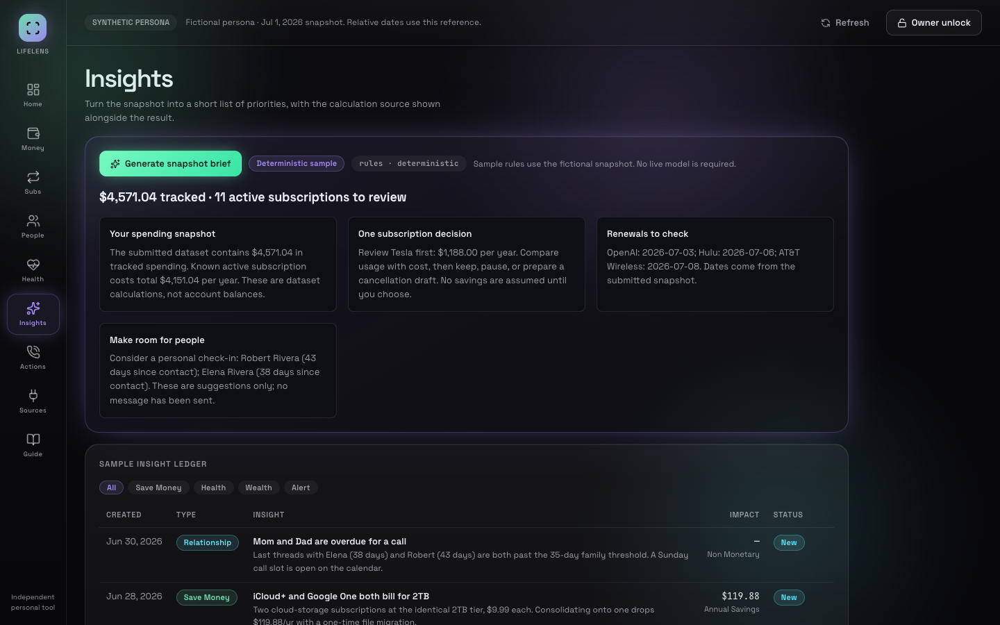

# Public release verification

September 14, 2026, Central Time. [Live demo](https://lifelens-copilot.netlify.app) · [Project](../README.md)

Accepted application source: `29e2c105d0840614f74be5a242ae8f9354922892`. Netlify release: `6aa81006ad25ab3ef9d11b0e`. Subsequent repository presentation changes affect documentation and screenshots only.

| Check | Evidence and scope |
|---|---|
| Real Chrome | Shanto's existing profile: all nine views; sample comparison, completed brief, script and dry-run call; eight owner controls disabled; unlock password field with normal 1Password suggestion, then cancel |
| Public API completion | Actual deterministic SSE results and done events; dry-run/not-owner result; no provider calls or private database access |
| Automated workflows | 62 workflow assertions and nine external links; desktop 1440×900 and mobile 390×844 |
| Tests/build/audit | 100 tests at the backend release; layout/label follow-ups passed targeted lint/build; production npm audit reported zero vulnerabilities |
| Final assets | Published JS/CSS hashes matched the clean build; nine Function digests unchanged by the final label correction |
| Browser errors | Final representative run clean; earlier navigation-aborted requests retained as diagnostics |

A historical broad control receipt contained **41 passing assertions and one failed zero-match assertion**, not 42/42. An independent control inventory and actual-profile inspection confirmed the eight disabled owner buttons; this did not erase the original failed assertion.

Screenshots are real public-deployment captures using the fictional Jordan Rivera sample. No live bank, owner snapshot, private Supabase mutation, completed OAuth connection, actual phone call, private runner execution or provider availability was verified. The source implements owner adapters, but this public release does not certify their deployment. No SQL/schema/RLS migration is included to infer that certification.

No runtime changes, new provider calls or new private workflows were performed for the later README presentation update. Reading a page successfully does not itself establish end-to-end completion.
