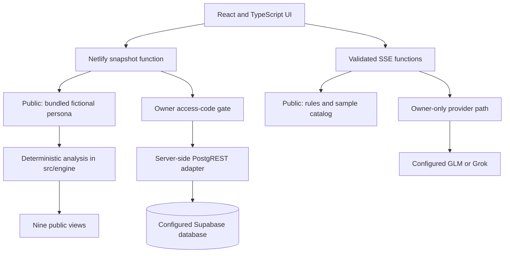

# LifeLens architecture and data model

[Project overview](../README.md) · [Verification](VERIFICATION-2026-09-14.md)

The public application is a **deterministic demonstration**. The repository also implements owner-only database and optional AI paths, which have a different verification boundary.

Solid arrows describe implemented routes, not a claim that every private dependency was exercised. The public portfolio pass used no private database, owner snapshot or paid LifeLens model request.

## Database integration: implemented versus verified

[`snapshot.mjs`](../netlify/functions/snapshot.mjs) checks `isOwner(req)` before reading Supabase. Public requests return `{ "mode": "synthetic", "bundled": true }`, and the browser uses [`src/data/persona.ts`](../src/data/persona.ts).

The server adapter calls `${SUPABASE_URL}/rest/v1/...` with `apikey` and Bearer headers derived from `SUPABASE_ANON_KEY`, plus the custom `x-lifelens-key` header from `SUPABASE_API_SECRET`. This is **not service-role authentication**. A custom header alone does not prove database enforcement: the deployed policies and their SQL must be inspected separately.

This public repository contains **no SQL migrations, CREATE TABLE definitions, RLS policy DDL or SQLite implementation**. The table names and fields below are an application data contract inferred directly from typed interfaces and REST calls, not an exported database schema. No production schema installation, policy validation, backup/restore, RDS, failover or private read/write acceptance is asserted.

## Application data contract

The shared domain is defined in [`src/lib/types.ts`](../src/lib/types.ts). `snapshot.mjs` maps snake_case or camelCase stored payloads into that domain.

| REST resource / domain | Fields the application uses | Implemented access |
|---|---|---|
| `profile` / `Profile` | Name, email, location, summary and structured signals | Owner snapshot selects `id=1` |
| `people` / `Person` | ID, name, emails, relationship, last contact, signals | Owner snapshot read; client relationship analysis |
| `transactions` / `Transaction` | ID, date, merchant, nullable amount, currency, category, kind | Recent snapshot read; maintenance reads history for rollups |
| `subscriptions` / `Subscription` | Merchant, cadence, costs, status, renewal dates, confidence | Snapshot read; manual maintenance PATCHes `next_renewal` |
| `alternatives` / `Alternative` | Subscription reference, offer name, price, savings, source/status | Snapshot read; public catalog is bundled/sample data |
| `insights` / `Insight` | Type, title, body, impact, status, creation time | Snapshot read; maintenance inserts derived insights |
| `events` / `LifeEvent` | Date, title, attendees, calendar, recurrence, kind | Owner snapshot read |
| `accounts` / `Account` | Institution, kind, last four, typical amount, evidence | Snapshot and maintenance read; no live bank API |
| `actions` / `ActionItem` | Kind, target, payload, status and result | Owner writes from action/script/call routes; public requests are dry-run |
| `runs` / maintenance receipt | Start/end, kind, status and statistics | Best-effort success/error insertion by manual maintenance |

No foreign-key, index, uniqueness or RLS constraint is implied by these TypeScript fields.

## Code paths worth reviewing

- [`snapshot.mjs`](../netlify/functions/snapshot.mjs): parallel reads from nine resources, bounded recent transactions/insights/actions, tolerant mapping into `Snapshot`.
- [`action.mjs`](../netlify/functions/action.mjs): validates action kinds and payload; non-owner or dry-run requests return without writing; owner requests POST an `actions` record.
- [`ingest-run.mjs`](../netlify/functions/ingest-run.mjs): authenticated manual POST using owner code or separate ingestion secret. Reads existing stored records, advances stale renewal dates, inserts deterministic insights and best-effort `runs` records. It does not itself fetch Gmail/Calendar or establish OAuth ingestion. No automatic schedule is configured.
- [`_shared/runtime.mjs`](../netlify/functions/_shared/runtime.mjs): timing-safe secret comparison, bounded JSON reading and deterministic public outputs.
- [`src/engine`](../src/engine): parsing/normalization, recurrence, spend/category calculations and relationship signals.

## Deployment and evidence boundary

Netlify serves the Vite build and Functions with same-origin CSP and no-store JSON responses. Public SSE routes return start/result/done or explicit errors. Owner-only narrative has provider code; live outbound call support is separately configured and was not exercised in this release.

[`/api/health`](https://lifelens-copilot.netlify.app/api/health) explicitly reports demo mode and configuration-only capability flags. A true Supabase flag means variables are present, not that the schema, policy or private query succeeded. See [verification](VERIFICATION-2026-09-14.md) and [threat model](threat-model.md) for the limits.
